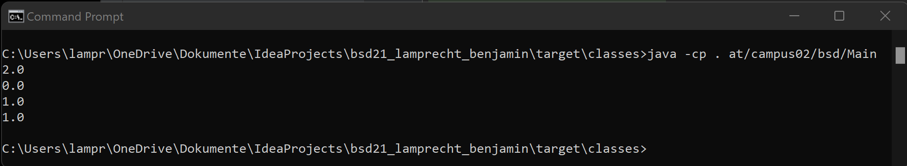

# my actions

1. via cmd, I cloned the repo link to my project folder
2. Intellij prevented to create a new project in a existing project folder. I created a temporary project and copied the files.
3. this file got created
4. .gitignore is updated (".idea" added)
5. package at.campus02.bsd created
6. calculator Java-Class is created in package
7. Main-Class created is created in package
8. Target Folder got created by first run\

9. pom.xml updated with new plugin
10. mvn compile\

11. first run in cmd\

12. finalize

